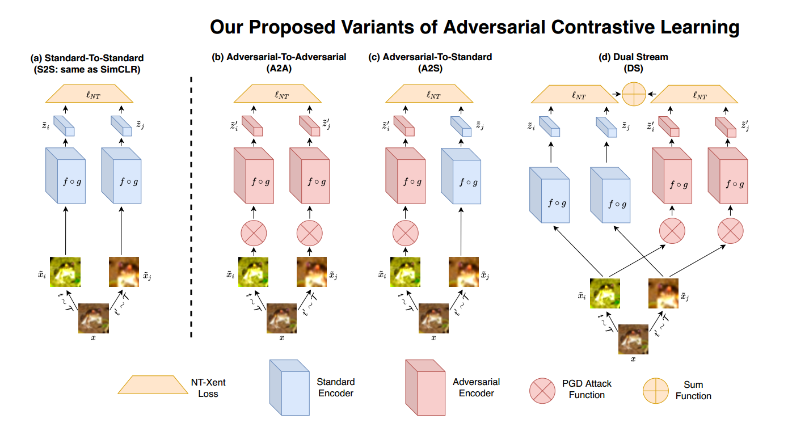

# Robust Pre-Training by Adversarial Contrastive Learning
## Introduction
Recent work has shown that, when integrated with adversarial training, self-supervised 
pre-training with several pretext tasks can lead to state-of-the-art robustness. In this 
work, we show that contrasting features to random and adversarial perturbations for consistency
 can benefit robustness-aware pre-training even further. Our approach leverages a recent 
 contrastive learning framework, which learns representations by maximizing feature consistency 
 under differently augmented views. This fits particularly well with the goal of adversarial robustness, 
 as one cause of adversarial fragility is the lack of feature invariance, i.e., small input perturbations 
 can result in undesirable large changes in features or even predicted labels. We explore various options 
 to formulate the contrastive task, and demonstrate that by injecting adversarial augmentations, 
 contrastive pre-training indeed contributes to learning data-efficient robust models. We extensively 
 evaluate the proposed Adversarial Contrastive Learning (ACL) and show it can consistently outperform state-of-the-arts. 
 For example on the CIFAR-10 dataset, ACL outperforms the latest unsupervised robust pre-training approach
  with substantial margins: 2.99% on robust accuracy and 2.14% on standard accuracy. We further demonstrate 
  that ACL pre-training can improve semi-supervised adversarial training, even at very low label rates.

## Method

Illustration of workflow comparison: (a) The original SimCLR framework, a.k.a., standard to standard (no adversarial attack involved); 
(b) - (d) three proposed variants of our adversarial contrastive learning framework: A2A, A2S, and DS (our best solution). 
Note that, whenever more than one encoder branches co-exist in one framework, they by default share all weights, except that adversarial and standard 
encoders will use independent BN parameters.
## Environment requirements
* Python (3.6.4)
* Pytorch (1.5.0)
* CUDA
* numpy

Thanks to the question from Muhammad Zaid Hameed, we found that there **would be a performance drop when using other Pytorch versions**. Please use pytorch 1.5.0 or 1.5.1 for reproducing our results.

## Pretraining
Pretrain the model on CIFAR-10 with ACL(DS)
```bash
python train_simCLR.py ACL_DS --ACL_DS --data /path/to/data
```
Pretrain the model on CIFAR-100 with ACL(DS)
```bash
python train_simCLR.py ACL_DS_CIFAR100 --ACL_DS --dataset cifar100 --data /path/to/data
```
## Finetuning
Adversarial finetune ACL(DS) pretraining model on CIFAR-10 (Need to do ACL(DS) pretraining on CIFAR10 first)
```bash
python train_trades.py ACL_DS_TUNE --checkpoint checkpoints/ACL_DS/model_1000.pt --cvt_state_dict --bnNameCnt 1 --decreasing_lr 40,60 --epochs 100 --data /path/to/data
```
Adversarial finetune ACL(DS) pretraining model on CIFAR-100 (Need to do ACL(DS) pretraining on CIFAR100 first)
```bash
python train_trades.py ACL_DS_CIFAR100_TUNE --dataset cifar100 --checkpoint checkpoints/ACL_DS_CIFAR100/model_1000.pt --cvt_state_dict --bnNameCnt 1 --data /path/to/data
```
## Semi-supervised adversarial training
On CIFAR-10 with 0.01 available labels (Need to do ACL(DS) pretraining on CIFAR10 first)
```bash
# train the standard model for generating psudo labels
python train_trades.py ACL_DS_SEMI_STAGE2_0.01LABELS --trainmode normal --trainset train0.01_idx --checkpoint checkpoints/ACL_DS/model_1000.pt --cvt_state_dict --bnNameCnt 0 --decreasing_lr 40,60 --epochs 100 --data /path/to/data
# Adversarial finetuning from ACL(DS) with the psudo labels
python train_trades_cifar10_semisupervised.py ACL_DS_SEMI_STAGE3_0.01LABELS --checkpoint checkpoints/ACL_DS/model_1000.pt --bnNameCnt 1 --cvt_state_dict --decreasing_lr 5,10 --epochs 15 --checkpoint_clean checkpoints_trade/ACL_DS_SEMI_STAGE2_0.01LABELS/best_model.pt --percentageLabeledData 1 --data /path/to/data
```
On CIFAR-10 with 0.1 available labels (Need to do ACL(DS) pretraining on CIFAR10 first)
```bash
# train the standard model for generating psudo labels
python train_trades.py ACL_DS_SEMI_STAGE2_0.1LABELS --trainmode normal --trainset train0.1_idx --checkpoint checkpoints/ACL_DS/model_1000.pt --cvt_state_dict --bnNameCnt 0 --decreasing_lr 40,60 --epochs 100 --data /path/to/data
# Adversarial finetuning from ACL(DS) with the psudo labels
python train_trades_cifar10_semisupervised.py ACL_DS_SEMI_STAGE3_0.1LABELS --checkpoint checkpoints/ACL_DS/model_1000.pt --bnNameCnt 1 --cvt_state_dict --decreasing_lr 5,10 --epochs 15 --checkpoint_clean checkpoints_trade/ACL_DS_SEMI_STAGE2_0.1LABELS/best_model.pt --percentageLabeledData 10 --data /path/to/data
```

## Checkpoint

### Pretraining
[[ACL_DS]](https://drive.google.com/file/d/1d5gZgqMpXl0-RiWH6sUcBvZZXJc2OrRF/view?usp=sharing)

Pretraining model on CIFAR10. To finetune from this checkpoint: use /path/to/downloadedCheckpoint for --checkpoint. For example
```bash
python train_trades.py ACL_DS_TUNE --checkpoint /path/to/downloadedCheckpoint --cvt_state_dict --bnNameCnt 1 --data /path/to/data
```

[[ACL_DS_CIFAR100]](https://drive.google.com/file/d/1DT5cnCsIDzhch5zoCitQRcWLmopdQsaJ/view?usp=sharing)

Pretraining model on CIFAR100. To finetune from this checkpoint: use /path/to/downloadedCheckpoint for --checkpoint. For example
```bash
CUDA_VISIBLE_DEVICES=0 python train_trades.py ACL_DS_TUNE_CIFAR100 --checkpoint checkpoints/ACL_DS_CIFAR100/ACL_DS_CIFAR100.pt --cvt_state_dict --bnNameCnt 1 --decreasing_lr 10,15 --epochs 20 --dataset cifar100
```

### Finetuning
[[ACL_DS_TUNE]](https://drive.google.com/file/d/1zLK5OTxaPkWK-i7MaGor7RnLKRYY9p-l/view?usp=sharing)

To evaluate:
```bash
python train_trades.py ACL_DS_TUNE --checkpoint /path/to/downloadedCheckpoint --eval-only --data /path/to/data
```
### Semi-supervised adversarial training
[[ACL_DS_SEMI_STAGE2_0.01LABELS]](https://drive.google.com/file/d/1PfDJXyF-PnwbKW1GsdiZRKza7C2Co-X1/view?usp=sharing) 

To evaluate:
```bash
python train_trades.py ACL_DS_SEMI_STAGE2_0.01LABELS --checkpoint /path/to/downloadedCheckpoint --eval-only --data /path/to/data
```

[[ACL_DS_SEMI_STAGE3_0.01LABELS]](https://drive.google.com/file/d/1y_2kz7VoGnSwfnWzb7KuB6ST01mvTnHw/view?usp=sharing)

To evaluate:
```bash
python train_trades.py ACL_DS_SEMI_STAGE3_0.01LABELS --checkpoint /path/to/downloadedCheckpoint --eval-only --data /path/to/data
```

[[ACL_DS_SEMI_STAGE2_0.1LABELS]](https://drive.google.com/file/d/1SOwFTOU4aU-YzzaE3AN14OLnvXySrSBs/view?usp=sharing)

To evaluate:
```bash
python train_trades.py ACL_DS_SEMI_STAGE2_0.1LABELS --checkpoint /path/to/downloadedCheckpoint --eval-only --data /path/to/data
```

[[ACL_DS_SEMI_STAGE3_0.1LABELS]](https://drive.google.com/file/d/1UNEQX38pRSGSw5Hee50Fn3nkXMVKnEW8/view?usp=sharing)

To evaluate:
```bash
python train_trades.py ACL_DS_SEMI_STAGE3_0.1LABELS --checkpoint /path/to/downloadedCheckpoint --eval-only --data /path/to/data
```

## Test against unforeseen attacks
1. Prepare the dataset CIFAR10-C
```shell script
wget https://zenodo.org/record/2535967/files/CIFAR-10-C.tar?download=1 --output-document 'CIFAR-10-C.tar'
tar -xvf CIFAR-10-C.tar
```
2. Test against unforseen attacks with ACL_DS_TUNE (require ACL_DS_TUNE)
```shell script
for atk in gaussian_noise impulse_noise pixelate shot_noise spatter zoom_blur motion_blur saturate snow speckle_noise contrast elastic_transform frost brightness defocus_blur fog gaussian_blur glass_blur jpeg_compression
do
CUDA_VISIBLE_DEVICES=0 python test2adversarial.py ACL_DS_TUNE --checkpoint /path/to/ACL_DS_TUNE --attack_type ${atk}
done
```
# Citation
```bash
@article{ACL2020,
    title = {Robust Pre-Training by Adversarial Contrastive Learning},
    author = {Ziyu Jiang and Tianlong Chen and Ting Chen and Zhangyang Wang},
    booktitle = {Advances in Neural Information Processing Systems 34},
    year = {2020}
    }
```
# Acknowledge
Trade fine-tuning code from [TRADE](https://github.com/yaodongyu/TRADES) (official code). 
